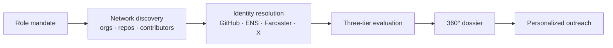

# Recruent 🦀

**The Talent engine for Crypto:** Rust, Solana, EVM, low-latency trading, ZK and Web3 infrastructure.

We evaluate engineers on the code they ship and their verifiable protocol pedigree, not résumé keywords.

[recruent.io](https://www.recruent.io) · [LinkedIn](https://www.linkedin.com/in/daisywanirwoth) · Based in Helsinki, Finland

> The source code is private. This repo is a public overview of what the engine does and how it works.

---

## Why it exists

The best protocol engineers are often pseudonymous, known only by an ENS name, or barely active on LinkedIn. Keyword search misses them. Recruent finds them through what they build and who they build with.

## How it finds engineers

- **Network-graph sourcing:** discovers engineers through real collaboration networks across protocol organizations, repositories and contributors, not keyword lists
- **Cross-platform identity resolution:** links GitHub, ENS, Farcaster and X into one verified identity, ENS-first, so `vitalik.eth` resolves to the right GitHub handle and wallets, with no same-name mix-ups
- **Verified pedigree:** employer and protocol claims are checked against a knowledge base of Web3 teams and how they relate (subsidiaries, acquisitions, ecosystems)
- **No strong candidate left behind:** engineers who keep their code private are evaluated on pedigree and identity signal, and flagged for human review instead of being scored to zero

## Specialist agents

| Agent | Focus |
|---|---|
| **DeFi** | Solidity/Vyper smart contracts, lending and stablecoin protocols, protocol security, token standards |
| **Trading** | Low-latency C++/Rust execution, AMM/DEX design, order-matching engines, MEV/searcher strategy, DEX/CLOB venues, market data, risk and margin |
| **Web3 Infra** | L1/L2 networks (geth, reth, prysm, lighthouse), consensus, ZK proving systems, rollups and sequencers, libp2p networking |
| **Composite** | A weighted blend of specialists for roles that span domains |

## Pipeline

## Three-tier evaluation

1. **Local model:** a deterministic fit score for every candidate
2. **Cloud model:** a fit summary and personalized outreach hook for candidates above the threshold
3. **Domain specialists:** primary and secondary agents score the candidate against the role's mandate

## 360° candidate dossier

One view per candidate: verified identity, social graph, specialist scores, engine-verified pedigree and connected entities, interview notes, and role linkage.

## Stack

**Backend:** Python, FastAPI, SQLite, Pydantic
**Frontend:** React, TypeScript, Tailwind CSS, Vite
**AI:** Claude API, Ollama (local models)
**Integrations:** GitHub API, ENS, X API, Farcaster (Neynar) API, Model Context Protocol (MCP), Resend, Gladia, Cloudflare R2

## Also: AI Startup roles

A second version of the engine sources AI/ML, Frontend and Backend engineers from GitHub and Hugging Face. It sourced **1,000+ engineer profiles in 3 months**.

## Hiring a web3 engineer?

Rust, Solana, EVM, trading infrastructure, ZK, L1/L2: the roles that stay open for months.

👉 **[recruent.io](https://www.recruent.io)**

---

Built by [Daisy Wanirwoth](https://www.linkedin.com/in/daisywanirwoth) · Talent Engineer · Building Recruent
