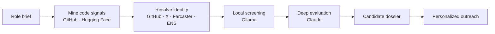

# Recruent 🦀

**AI talent engine for hard-to-fill engineering roles.**
We find engineers through their code, not their LinkedIn headlines.

[recruent.io](https://www.recruent.io) · [LinkedIn](https://www.linkedin.com/in/daisywanirwoth) · Based in Helsinki, Finland

> The source code is private. This repo is a public overview of what the engine does and how it works.

---

## Why it exists

The best engineers in crypto and AI often have sparse LinkedIn profiles, pseudonymous handles, or 13 GitHub followers. Keyword search misses them. Recruent's engine looks at what people actually build: their commits, dependencies, contributions and on-chain activity.

## What it does

- **Mines GitHub and Hugging Face** for engineers based on real work: repos, contribution graphs and dependency networks
- **Resolves identities** across GitHub, X, Farcaster and ENS, so pseudonymous builders can be found and verified
- **Builds a 360° candidate profile** from their code, social graph and portfolio
- **Screens candidates in two stages**: a local model filters first, then Claude evaluates the shortlist against the role
- **Produces candidate dossiers** that combine work history, technical strengths and role fit
- **Runs personalized outreach**, referencing the specific work that made each candidate stand out

## How it works

## Specialist agents

| Agent | Focus |
|---|---|
| **AI & Startups** | Frontend, backend and AI/ML engineers |
| **DeFi** | Protocol and smart contract engineers |
| **Trading / Solana** | Low-latency, trading infrastructure and Solana engineers |
| **Web3 Infra** | L1/L2, client and protocol infrastructure engineers |

## Stack

Claude API · Ollama · GitHub API · X API · Farcaster · ENS · Resend · Gladia · Cloudflare Tunnels

## Results

- **1,000+ engineer profiles** sourced in 3 months by the AI & Startups engine
- Finds candidates conventional search misses: pseudonymous contributors, niche-library maintainers, builders without polished profiles

## Status

- AI & Startups engine: live and in daily use
- Web3 engine: backend complete, frontend in progress

## Hiring a hard-to-find engineer?

Rust, trading infrastructure, DeFi, Solana, L1/L2 or AI. The roles that stay open for months.

👉 **[recruent.io](https://www.recruent.io)**

---

Built by [Daisy Wanirwoth](https://www.linkedin.com/in/daisywanirwoth), Talent Engineer · Building Recruent
